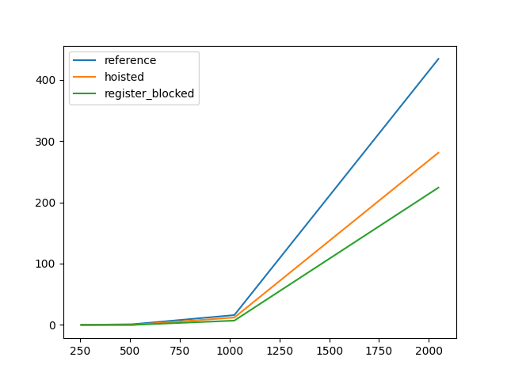

# C++ for high perfomance computing

Examples of using modern C++ for high performance computing.

## Examples

- [Newton's method for computing the square root](0_hello_world/newton.cpp)

- [vector class](1_vector/Vector.hpp)

- [Matrix class](2_matrix/Matrix.hpp)

- Matrix multiplication



## Run the examples

```shell
clang++/g++ -std=c++23 example.cpp
```

## Ressources used
- [AMATH 483/583: High-Performance Scientific Computing](https://amath583.github.io/sp21/index.html)

